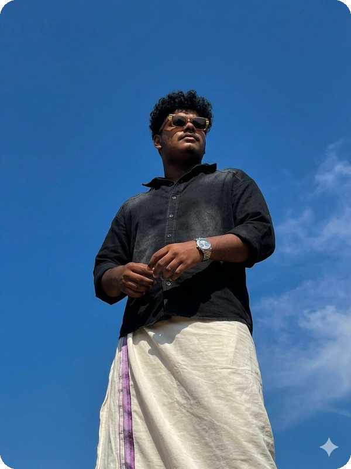
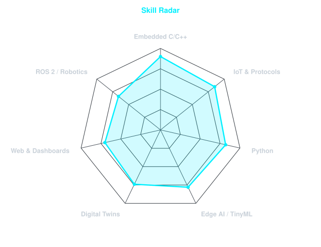
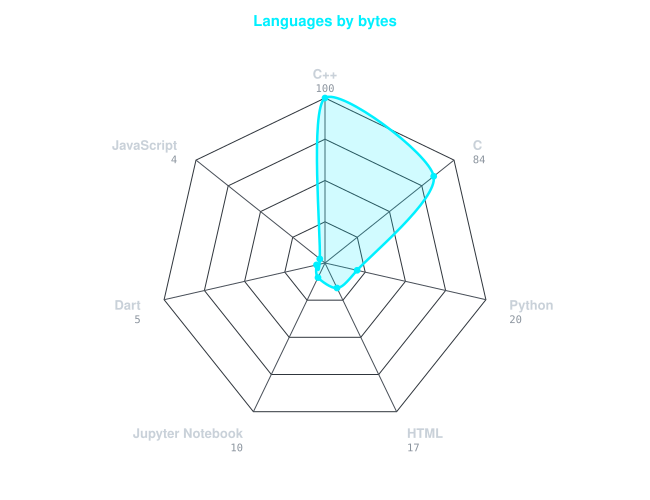
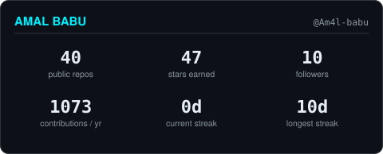
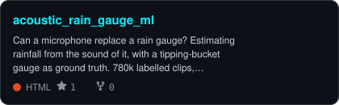
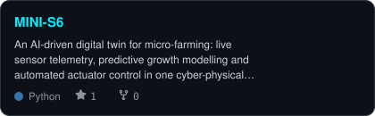
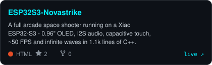
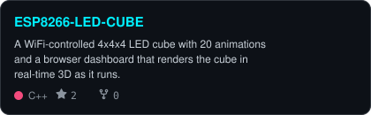

<div align="center">

<!-- BANNER - the pixel-art coding-room GIF carried over from the previous
     profile README. Hosted on GitHub's own user-images CDN, so it is not
     going anywhere, but it is the one image on this page not generated from
     a file in this repo. -->


<br><br>

<!-- PORTRAIT - the photograph itself, corners rounded. This is the
     photo--sky-round cell of the treatment x backdrop matrix; scripts/looks.py
     renders all 24 into assets/options/ if you want to swap it for a cutout,
     a duotone, a halftone or a circular crop.
     Regenerate with:  python scripts/looks.py --only photo
     then:             copy assets\options\photo--sky-round.png assets\portrait.png
     Rendered at 600px for a 300px slot, so it stays sharp on a retina screen. -->


<br>

<!-- NAME / TAGLINE - animated typing -->
<a href="https://github.com/Am4l-babu">
  
</a>

<br>

<!-- SOCIALS -->
<a href="https://www.linkedin.com/in/aml02"></a>
<a href="mailto:itzmeaml02@gmail.com"></a>
<a href="https://www.itzmeaml.in/"></a>
<a href="https://www.kaggle.com/cdohlab/datasets"></a>


</div>

---

## `~/` whoami

```console
$ cat about.txt
```

Hi, I'm **Amal Babu**. I push intelligence to the edge — microcontrollers, sensors and small
models that have to run where there is no cloud to fall back on. Mechanical Engineering
first, CSE in AI now, which mostly means I enjoy the seam where the algorithm meets the hardware.

- Currently building **[acoustic_rain_gauge_ml](https://github.com/Am4l-babu/acoustic_rain_gauge_ml)** — rainfall estimated from the *sound* of it
- Portfolio: **[itzmeaml.in](https://www.itzmeaml.in/)**
- Exploring **Spiking Neural Networks, TinyML and digital-twin pipelines**
- Based in **Chalakudy, Kerala** 🌴
- Fun fact: **most of my projects start as a 3D print and end as a firmware bug.**

<br>

<div align="center">

## `~/` toolbox


</div>

---

<div align="center">

## `~/` skill radar

<table>
<tr>
<td width="50%" align="center" valign="middle">

<!-- Self-rated radar - edit assets/skills.json, the workflow redraws it -->
<picture>
  <source media="(prefers-color-scheme: dark)"  srcset="assets/radar-dark.svg">
  <source media="(prefers-color-scheme: light)" srcset="assets/radar-light.svg">
  
</picture>

</td>
<td width="50%" align="center" valign="middle">

<!-- Live radar built from real language byte counts across the repos -->
<picture>
  <source media="(prefers-color-scheme: dark)"  srcset="assets/radar-langs-dark.svg">
  <source media="(prefers-color-scheme: light)" srcset="assets/radar-langs-light.svg">
  
</picture>

</td>
</tr>
</table>

</div>

---

<div align="center">

## `~/` contribution calendar

<!-- 3D isometric calendar, regenerated every 6h by .github/workflows/metrics.yml -->
<picture>
  <source media="(prefers-color-scheme: dark)"  srcset="assets/metrics.isocalendar-dark.svg">
  <source media="(prefers-color-scheme: light)" srcset="assets/metrics.isocalendar.svg">
  
</picture>

<br><br>

<!-- Snake eats the contribution graph - .github/workflows/snake.yml -->
<picture>
  <source media="(prefers-color-scheme: dark)"  srcset="https://raw.githubusercontent.com/Am4l-babu/Am4l-babu/output/snake-dark.svg">
  <source media="(prefers-color-scheme: light)" srcset="https://raw.githubusercontent.com/Am4l-babu/Am4l-babu/output/snake.svg">
  
</picture>

</div>

---

<div align="center">

## `~/` the numbers

<!-- Generated by scripts/cards.py into this repo. Deliberately NOT
     github-readme-stats / streak-stats / github-profile-trophy: those are
     shared public instances that go down and take the whole section with them. -->
<picture>
  <source media="(prefers-color-scheme: dark)"  srcset="assets/card-stats-dark.svg">
  <source media="(prefers-color-scheme: light)" srcset="assets/card-stats-light.svg">
  
</picture>

<br>

<picture>
  <source media="(prefers-color-scheme: dark)"  srcset="assets/metrics.languages-dark.svg">
  <source media="(prefers-color-scheme: light)" srcset="assets/metrics.languages.svg">
  
</picture>

<br><br>

<picture>
  <source media="(prefers-color-scheme: dark)"  srcset="assets/metrics.achievements-dark.svg">
  <source media="(prefers-color-scheme: light)" srcset="assets/metrics.achievements.svg">
  
</picture>

</div>

---

<div align="center">

## `~/` selected work

<!-- Cards generated by scripts/cards.py from assets/projects.json.
     Stars, forks and language are pulled live from the API on every run. -->
<table>
<tr>
<td width="50%">
  <a href="https://github.com/Am4l-babu/acoustic_rain_gauge_ml">
    <picture>
      <source media="(prefers-color-scheme: dark)"  srcset="assets/card-acoustic_rain_gauge_ml-dark.svg">
      <source media="(prefers-color-scheme: light)" srcset="assets/card-acoustic_rain_gauge_ml-light.svg">
      
    </picture>
  </a>
</td>
<td width="50%">
  <a href="https://github.com/Am4l-babu/MINI-S6">
    <picture>
      <source media="(prefers-color-scheme: dark)"  srcset="assets/card-MINI-S6-dark.svg">
      <source media="(prefers-color-scheme: light)" srcset="assets/card-MINI-S6-light.svg">
      
    </picture>
  </a>
</td>
</tr>
<tr>
<td width="50%">
  <a href="https://github.com/Am4l-babu/ESP32S3-Novastrike">
    <picture>
      <source media="(prefers-color-scheme: dark)"  srcset="assets/card-ESP32S3-Novastrike-dark.svg">
      <source media="(prefers-color-scheme: light)" srcset="assets/card-ESP32S3-Novastrike-light.svg">
      
    </picture>
  </a>
</td>
<td width="50%">
  <a href="https://github.com/Am4l-babu/ESP8266-LED-CUBE">
    <picture>
      <source media="(prefers-color-scheme: dark)"  srcset="assets/card-ESP8266-LED-CUBE-dark.svg">
      <source media="(prefers-color-scheme: light)" srcset="assets/card-ESP8266-LED-CUBE-light.svg">
      
    </picture>
  </a>
</td>
</tr>
</table>

<sub>

| project | live | stack |
|---|---|---|
| **[acoustic_rain_gauge_ml](https://github.com/Am4l-babu/acoustic_rain_gauge_ml)** | [Kaggle datasets](https://www.kaggle.com/cdohlab/datasets) | `Python` `XIAO ESP32-S3` `INMP441` |
| **[MINI-S6](https://github.com/Am4l-babu/MINI-S6)** | — | `Python` `Flask` `Digital Twin` |
| **[ESP32S3-Novastrike](https://github.com/Am4l-babu/ESP32S3-Novastrike)** | [novastrike-gamma.vercel.app](https://novastrike-gamma.vercel.app) | `C++` `SSD1306` `I2S` |
| **[ESP8266-LED-CUBE](https://github.com/Am4l-babu/ESP8266-LED-CUBE)** | — | `C++` `PlatformIO` `WebSockets` |
| **[pazhamAI](https://github.com/Am4l-babu/pazhamAI)** | [pazhamai.vercel.app](https://pazhamai.vercel.app) | `Python` `scikit-learn` |
| **[wireclaw](https://github.com/Am4l-babu/wireclaw)** | — | `C++` `PlatformIO` `Robotics` |

</sub>

</div>

---

<div align="center">

## `~/` habits

<!-- Commits by hour of day and weekday, from .github/workflows/metrics.yml -->
<picture>
  <source media="(prefers-color-scheme: dark)"  srcset="assets/metrics.habits-dark.svg">
  <source media="(prefers-color-scheme: light)" srcset="assets/metrics.habits.svg">
  
</picture>

</div>

---

<div align="center">

<sub>`01110100 01101000 01100001 01101110 01101011 01110011 00100000 01100110 01101111 01110010 00100000 01110011 01100011 01110010 01101111 01101100 01101100 01101001 01101110 01100111`</sub>

</div>
